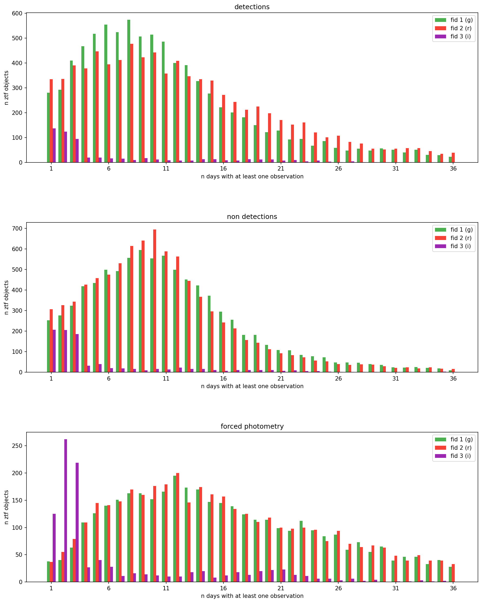
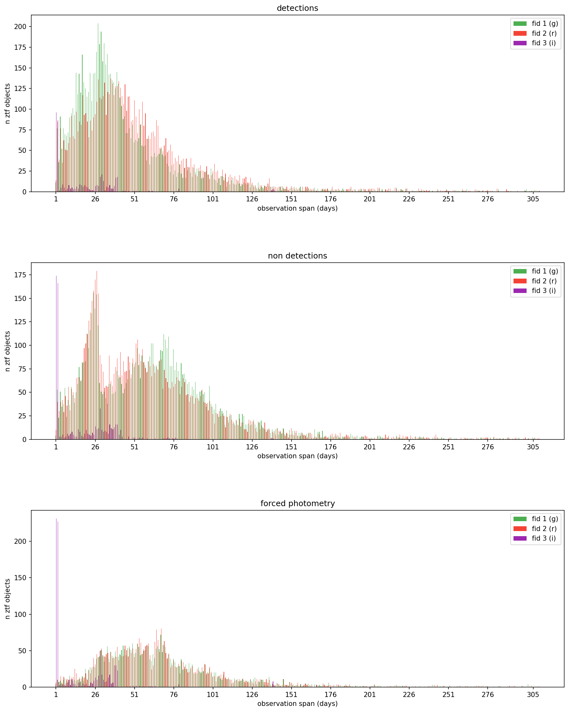

# Day 0 — Feature Analysis: Lightcurve Availability

## Goal

Before extracting any features, understand the raw availability and size of ZTF lightcurves per band. How many objects actually have usable data, and how much of it?

## ZTF Lightcurve Structure

Each ZTF object contains three separate time series, one per observation type:

- **Detections** — points where the transient was significantly detected above the background. The primary lightcurve used for feature extraction.
- **Non-detections** — epochs where the object was not detected, providing upper limits on brightness. Useful for constraining the explosion epoch and rise time.
- **Forced Photometry** — flux measurements forced at the transient position regardless of detection significance. Extends the lightcurve into the pre-explosion baseline and faint tail, but noisier than detections.

All three are recorded per band (g, r, i) and reported as unique observation days (`n_`) and total timespan in days (`d_`).

## Observations per Band

### Observation availability

| Band (fid) | Detections | Non-detections | Forced Photometry |
|---|---|---|---|
| g (1) | 95% | 97% | 45% |
| r (2) | 97% | 97% | 46% |
| i (3) | 7% | 10% | 11% |

### Observation count

| Band (fid) | n_det | n_non_det | n_forced |
|---|---|---|---|
| g (1) | 12.0 ± 15.1 | 11.8 ± 10.6 | 8.6 ± 13.5 |
| r (2) | 14.2 ± 15.7 | 11.2 ± 12.7 | 8.8 ± 13.8 |
| i (3) | 0.5 ± 2.9 | 0.6 ± 2.7 | 0.8 ± 3.9 |

### Observation span

| Band (fid) | d_det (days) | d_non_det (days) | d_forced (days) |
|---|---|---|---|
| g (1) | 59 ± 163 | 104 ± 260 | 35 ± 67 |
| r (2) | 82 ± 206 | 105 ± 269 | 36 ± 70 |
| i (3) | 2 ± 27 | 2 ± 23 | 3 ± 28 |

## Conclusions

- g and r are solid — ~96% of objects have detections in both bands with a reasonable number of unique days and observation spans
- i-band is basically unusable
- Detections and Non-detections are well covered but forced photometry is only available less than half of the data
